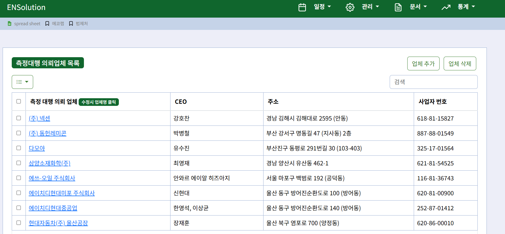
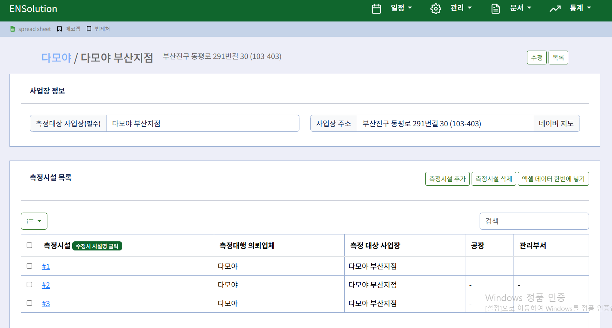
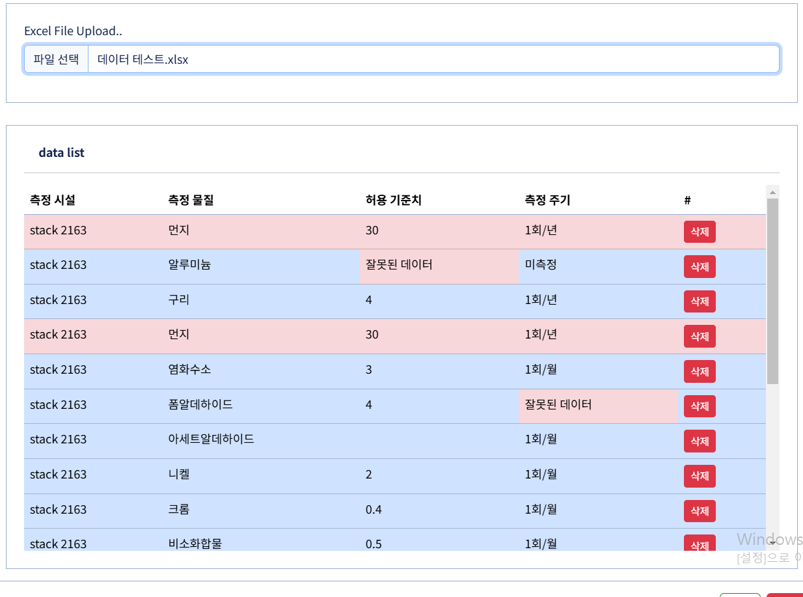
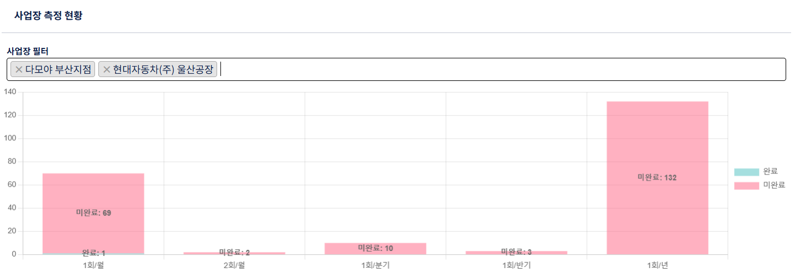

# ENSolution
환경 측정 대행 업체를 위한 대기, 수질, 악취 등 환경 측정 업무의 자동화 및 문서 관리 솔루션
## 주요 기능 *(개발 예정 기능 포함)*
1. 업체 데이터 관리
   1. 측정대행 의뢰업체 관리 (Company)
   2. 측정대상 사업장 관리 (Workplace)
   3. 측정시설 관리 (Stack)
   
   
   4. 측정항목 관리 (Stack_Measurement)
   5. 
      1. 엑셀 데이터 업로드 기능
      
   5. 측정 오염물질 주기 관리 (Pollutant)
2. 측정 일정 관리
   1. 일정 등록 기능
   2. 측정시설 및 측정항목의 주기별 완료 현황 확인
   3. 주기별 일정 초기화
3. 측정 데이터 통계 및 시각화
   1. 사업장 별 측정 완료 지점 수 시각화 차트
   
   2. 매출 보고서 (**개발 예정**)
4. 용역이행능력평가 점수 계산
5. 문서 관리 (**개발 예정**)
   1. 품질 문서 관리
      1. 내부 장비 교정서
      2. 성적서
      3. 그 외 모든 문서
   2. 사내 문서 관리
      1. 차량운행일지
      2. 인수인계서
      3. 장비관리대장
      4. 여지관리대장
      5. 차량관리대장
      6. 그 외 모든 문서
### 기술 스택
- **프론트엔드:** HTML, CSS, JavaScript
- **백엔드:** Java, Spring Boot
- **데이터베이스:** MySQL
### 데이터베이스
| Table                 | Field                                                                   | Foreign Key                              |
|-----------------------|-------------------------------------------------------------------------|------------------------------------------|
| company               | company_id, company_name, address, ceo, biz_number, reg_date            |                                          |
| workplace             | workplace_id, workplace_name, address, reg_date                         | company_id                               |
| factory               | factory_id, factory_name                                                | workplace_id                             |
| sub_factory           | sub_factory_id, sub_factory_name                                        | factory_id                               |
| stack                 | stack_id, stack_name, prevention, note, reg_date                        | sub_factory_id, management_department_id |
| stack_info            | stack_info_id, 필요 재원들                                                   | stack_id                                 |
| stack_images          | stack_images_id, image_name, image_data                                 | stack_id                                 |
| pollutant             | pollutant_id, pollutnat_name, name_en, method                           |                                          |
| stack_measurement     | stack_measurement_id, cycle_type, is_completed, is_measure, allow_value | stack_id, pollutant_id                   |
| schedule              | schedule_id, measure_date, is_completed                                 | team_id, stack_measurement_id            |
| team                  | team_id, team_name                                                      |                                          |
| management_department | management_department_id, management_department_name, tel               | workplace_id                             |
### RESTful API 설계
<table>
  <tr>
    <th>대상</th>
    <th>동작</th>
    <th>상위 URL</th>
    <th>하위 URL</th>
    <th>하위 URL</th>
    <th>HTTP method</th>
  </tr>
  <tr>
    <td rowspan="5">company</td>
    <td>List all companies</td>
    <td rowspan="23">/management</td>
    <td rowspan="4">/companies</td>
    <td rowspan="4"></td>
    <td>GET</td>
  </tr>
  <tr>
    <td>Create a company</td>
    <td>POST</td>
  </tr>
  <tr>
    <td>Modify a company</td>
    <td>PATCH</td>
  </tr>
  <tr>
    <td>Delete companies</td>
    <td>DELETE</td>
  </tr>
  <tr>
    <td>Get a specific company</td>
    <td>/companies/{company_id}</td>
    <td></td>
    <td>GET</td>
  </tr>
  <tr>
    <td rowspan="6">workplace</td>
    <td>List all workplaces</td>
    <td rowspan="4">/workplaces</td>
    <th rowspan="4"></th>
    <td>GET</td>
  </tr>
  <tr>
    <td>Create a workplace</td>
    <td>POST</td>
  </tr>
  <tr>
    <td>Modify a workplace</td>
    <td>PATCH</td>
  </tr>
  <tr>
    <td>Delete workplaces</td>
    <td>DELETE</td>
  </tr>
  <tr>
    <td>Get a specific workplace</td>
    <td rowspan="2">/workplaces/{workplace_id}</td>
    <td></td>
    <td>GET</td>
  </tr>
  <tr>
    <td>Create stack measurement By excel form</td>
    <td>/upload/excel</td>
    <td>POST</td>
  </tr>
  <tr>
    <td rowspan="8">stack</td>
    <td>List all stacks</td>
    <td rowspan="4">/stacks</td>
    <td rowspan="4"></td>
    <td>GET</td>
  </tr>
  <tr>
    <td>Create a stack</td>
    <td>POST</td>
  </tr>
  <tr>
    <td>Modify a stack</td>
    <td>PATCH</td>
  </tr>
  <tr>
    <td>Delete stacks</td>
    <td>DELETE</td>
  </tr>
  <tr>
    <td>Get a specific stack</td>
    <td rowspan="8">/stacks/{stack_id}</td>
    <td></td>
    <td>GET</td>
  </tr>
<tr>
    <td>Modify note of stack</td>
    <td>/note</td>
    <td>PATCH</td>
  </tr>
  <tr>
    <td>Get image files</td>
    <td rowspan="2">/images</td>
    <td>GET</td>
  </tr>
  <tr>
    <td>Upload image file of a stack </td>
    <td>POST</td>
  </tr>
  <tr>
    <td>stack information</td>
    <td>Modify a stackInformation</td>
    <td>/info</td>
    <td>POST</td>
  </tr>
  <tr>
    <td rowspan="3">stack measurement</td>
    <td>Get measurements of a specific stack</td>
    <td rowspan="3">/stack-measurements</td>
    <td>GET</td>
  </tr>
  <tr>
    <td>Create stack measurements</td>
    <td>POST</td>
  </tr>
  <tr>
    <td>Delete measurements of a specific stack</td>
    <td>DELETE</td>
  </tr>
  <tr>
    <td rowspan="2">availability-score</td>
    <td>Get a pollutant list</td>
    <td rowspan="2">/document</td>
    <td rowspan="2">/availability-score</td>
    <td rowspan="2"></td>
    <td>GET</td>
  </tr>
  <tr>
    <td>Calculate availability score</td>
    <td>POST</td>
  </tr>
  <tr>
    <td rowspan="5">schedule</td>
    <td>Calendar View</td>
    <td rowspan="5">/schedule</td>
    <td rowspan="2">/calendar</td>
    <td rowspan="2"></td>
    <td>GET</td>
  </tr>
  <tr>
    <td>Delete schedules of calendar</td>
    <td>DELETE</td>
  </tr>
  <tr>
    <td>Register schedule</td>
    <td rowspan="3">/register</td>
    <td></td>
    <td>POST</td>
  </tr>
  <tr>
    <td>Get stacks of workplace</td>
    <td>/stacks</td>
    <td>GET</td>
  </tr>
  <tr>
    <td>Get stack-measurements of stack</td>
    <td>/stack-measurements</td>
    <td>GET</td>
  </tr>
  <tr>
    <td rowspan="3">dashboard</td>
    <td>Dashboard main view</td>
    <td rowspan="3">/dashboard</td>
    <td></td>
    <td></td>
    <td>GET</td>
  </tr>
  <tr>
    <td>Global chart view</td>
    <td rowspan="2">/chart</td>
    <td>/global</td>
    <td>GET</td>
  </tr>
  <tr>
    <td>Chart view of workplaces</td>
    <td>/workplaces</td>
    <td>GET</td>
  </tr>
</table>

### RESTful API 설계에 대한 개인적인 생각
- 왜 중요한가?
  1. 개발자 간의 협업을 위한 필수 요소
     - 표준화된 설계 방식에 따라 구현하기 때문에 빠르게 프로젝트에 적응 가능
     - 따라서, 원활한 협업이 가능
  2. 사용자 경험 (User Experience) 향상
     - 경로만 봐도 "어디에 있는가?"를 알 수 있음
- 주의할 점
  1. API 설계 원칙에 너무 매몰되는 것은 위험하다.
     - 가장 중요한 목적은 개발자 간의 협업과 UX를 향상 시키기 위한 도구일 뿐이다.
     - 구성원 간의 합의점을 찾아 유연한 설계가 필요

### 준비 사항
1. Java Development Kit (JDK) 21
2. MySQL Database
- 기본 데이터베이스 이름 : ensolution
- git 프로젝트 > ensolution.sql 다운로드